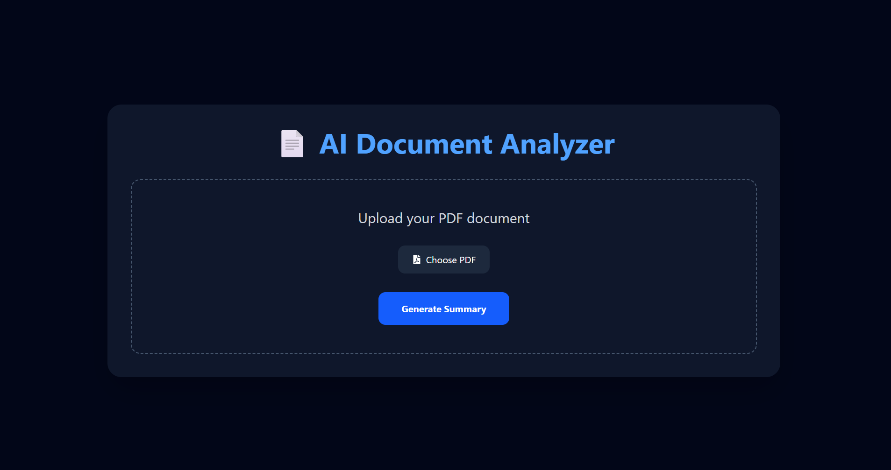
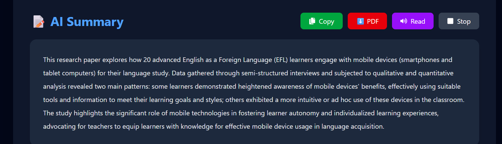
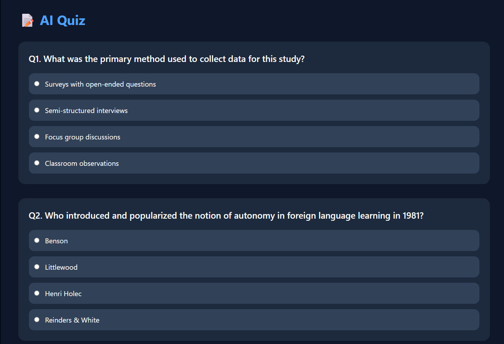
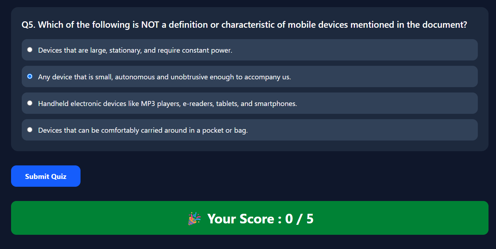

# 📄 AI Document Analyzer

An AI-powered web application that enables users to upload PDF documents and instantly generate AI-powered summaries, extract important keywords, and create interactive quizzes using **Google Gemini AI**. The application is designed to make studying, reviewing research papers, and understanding lengthy documents faster and more efficient.

🔗 **Live Demo:** https://ai-document-analyzer-theta.vercel.app

---

# 🚀 Features

- 📄 Upload PDF documents
- 🤖 AI-powered document summarization using Google Gemini AI
- 🔑 Automatic keyword extraction
- 📝 AI-generated multiple-choice quiz based on uploaded PDF
- 📊 Instant quiz evaluation and score calculation
- 📋 Copy summary to clipboard
- 📥 Download AI-generated summary as PDF
- 🔊 Text-to-Speech (Read Summary)
- ⚡ Fast PDF processing
- 🎨 Modern, responsive UI
- 🌐 REST API powered by FastAPI
- ☁️ Cloud deployment using Vercel and Render

---

# 🖼️ Screenshots


### 🏠 Home Page



### 📄 AI Summary



### 🔑 Keywords


### 📝 AI Quiz



### 📊 Quiz Result



---

# 🛠 Tech Stack

## Frontend

- React.js
- Vite
- Axios
- React Icons
- CSS3

## Backend

- FastAPI
- Python
- PyPDF2
- Google Gemini AI API
- Uvicorn

## Deployment

- Frontend → Vercel
- Backend → Render

---

# 📂 Project Structure

```text
AI-Document-Analyzer
│
├── backend
│   ├── main.py
│   ├── summarizer.py
│   ├── pdf_utils.py
│   ├── requirements.txt
│   └── .env
│
├── frontend
│   ├── src
│   ├── public
│   ├── package.json
│   └── vite.config.js
│
└── README.md
```

---

# ⚙️ Installation

## 1️⃣ Clone the Repository

```bash
git clone https://github.com/Anubhav2703/AI-Document-Analyzer.git

cd AI-Document-Analyzer
```

---

## 2️⃣ Backend Setup

```bash
cd backend

python -m venv venv
```

### Windows

```bash
venv\Scripts\activate
```

### Linux / macOS

```bash
source venv/bin/activate
```

Install the dependencies

```bash
pip install -r requirements.txt
```

Run the backend server

```bash
uvicorn main:app --reload
```

Backend runs at

```
http://127.0.0.1:8000
```

---

## 3️⃣ Frontend Setup

```bash
cd frontend

npm install

npm run dev
```

Frontend runs at

```
http://localhost:5173
```

---

# 📖 How It Works

1. Upload a PDF document.
2. The backend extracts text from the PDF using **PyPDF2**.
3. Extracted text is sent to **Google Gemini AI**.
4. Gemini analyzes the document and generates:
   - 📄 AI Summary
   - 🔑 Important Keywords
   - 📝 Multiple Choice Quiz
5. Results are displayed instantly.
6. Users can:
   - 🔊 Listen to the summary
   - 📋 Copy the summary
   - 📥 Download the summary as PDF
   - 📝 Attempt the generated AI quiz
   - 📊 View their quiz score

---

# 🌐 Live Deployment

## Frontend

https://ai-document-analyzer-theta.vercel.app

## Backend API

https://anubhav-ai-document-analyzer.onrender.com

---

# 📌 API Endpoint

## POST `/summarize`

Upload a PDF using **multipart/form-data**.

### Response

```json
{
  "summary": "AI-generated summary...",
  "keywords": [
    "Artificial Intelligence",
    "Machine Learning",
    "Deep Learning"
  ],
  "quiz": [
    {
      "question": "What is the primary topic of the document?",
      "options": [
        "Option A",
        "Option B",
        "Option C",
        "Option D"
      ],
      "answer": "Option A"
    }
  ]
}
```

---

# 🎯 Key Highlights

- 🤖 Google Gemini AI Integration
- 📄 AI-powered PDF Summarization
- 🔑 Keyword Extraction
- 📝 AI Quiz Generation
- 📊 Quiz Score Evaluation
- 📋 Copy Summary
- 📥 Download Summary as PDF
- 🔊 Text-to-Speech Support
- ⚡ FastAPI REST API
- 🎨 Responsive React UI
- ☁️ Cloud Deployment using Vercel & Render

---

# 🚀 Future Improvements

- 💬 Chat with PDF (RAG)
- 🌍 Multi-language Summaries
- 📚 Flashcard Generation
- 📈 Reading Difficulty Analysis
- 📌 Highlight Important Sentences
- 🔍 Semantic Search
- 🤖 AI Study Assistant
- 📜 Quiz History
- 📊 User Dashboard
- ☁️ User Authentication & Cloud Storage

---

# 👨‍💻 Author

**Anubhav Pratap Singh**

### GitHub

https://github.com/Anubhav2703

### LinkedIn

https://www.linkedin.com/in/anubhav-pratap-singh-571b61297/

---

# 🤝 Contributing

Contributions, issues, and feature requests are welcome.

Feel free to fork this repository and submit a Pull Request.

---

# ⭐ Support

If you found this project useful, please consider giving it a ⭐ on GitHub.

It helps others discover the project and motivates future improvements.

---

# 📄 License

This project is licensed under the **MIT License**.

---

## 🙏 Acknowledgements

- Google Gemini AI
- FastAPI
- React.js
- Vite
- PyPDF2
- Vercel
- Render
